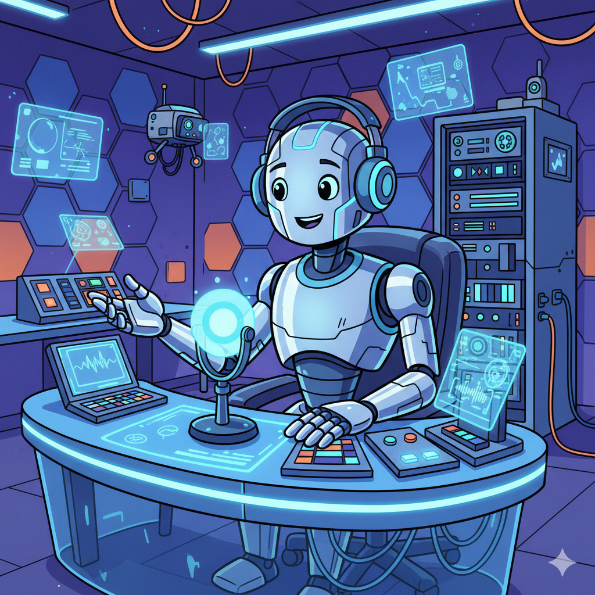

[OpenAi Badge]: https://img.shields.io/badge/OpenAI-412991?style=for-the-badge&logo=openai&labelColor=000&logoColor=412991
[Gemini Badge]: https://img.shields.io/badge/Google%20Gemini-8E75B2?style=for-the-badge&logo=googlegemini&labelColor=000
[ElevenLabs Badge]: https://img.shields.io/badge/ElevenLabs-000?style=for-the-badge&logo=elevenlabs&labelColor=000

<h1 align="center">Projeto Podcast Gerado por I.A.s</h1>

![openai][OpenAi Badge] &nbsp;
![gemini][Gemini Badge] &nbsp;
![elevenlabs][ElevenLabs Badge]

> ℹ️ Este projeto foi desenvolvido como parte do desafio do bootcamp: "Universia - Fundamentos de IA Generativa" da [DIO](https://www.dio.me)

### 🎧 Episódio Piloto: O Futuro do Metaverso: Utopia ou Distopia?

Neste episódio, mergulhamos de forma bem-humorada no universo do metaverso. Será que estamos caminhando para uma utopia digital cheia de liberdade e novas experiências, ou para uma distopia onde a vida real se torna irrelevante e somos controlados por algoritmos?

Aperte o play e descubra se você será o herói do metaverso ou ficará preso em um loop de reuniões virtuais!

    <audio src="./output/podcast-ep.mp3" controls title="Episódio Piloto: O Futuro do Metaverso: Utopia ou Distopia?"></audio>

## 📄 Sobre o projeto

Projeto com o objetivo de criar um podcast do zero utilizando exclusivamente ferramentas de Inteligência Artificial, desde a concepção do roteiro até a geração da capa e da narração.

A ideia central é demonstrar uma esteira de produção de conteúdo onde prompts bem elaborados guiam as I.A.s em cada etapa do processo criativo.

## 💻 Tecnologias utilizadas no projeto

- [ChatGPT](https://chat.openai.com/)
- [Google Gemini](https://gemini.google.com/app)
- [ElevenLabs](https://beta.elevenlabs.io/)
- [Capcut](https://www.capcut.com/pt-br/)

## 📝 Como foi feito ?

- **Roteiro** gerado via chatgpt
- **Audio** gerado pela elevenLabs
- **Capa** gerada pelo google gemini
- Capcut para tratar aúdio e adicionar leves efeitos

## 🛠️ Instruções de execução

Para replicar o processo e criar seu próprio podcast, você pode seguir os passos abaixo, utilizando os prompts e materiais de apoio.

1.  🤖 **Roteiro com ChatGPT:** Use os prompts disponíveis em `src/prompts/chatgpt.md` para gerar seu próprio roteiro.
2.  🤖 **Narração com ElevenLabs:** Copie os trechos do roteiro gerado e cole na plataforma da ElevenLabs para criar o áudio.
3.  🤖 **Capa com Goggle Gemini:** Use o prompt de arte para disponível em `src/prompts/google-gemini.md` para gerar uma capa para o seu podcast.
